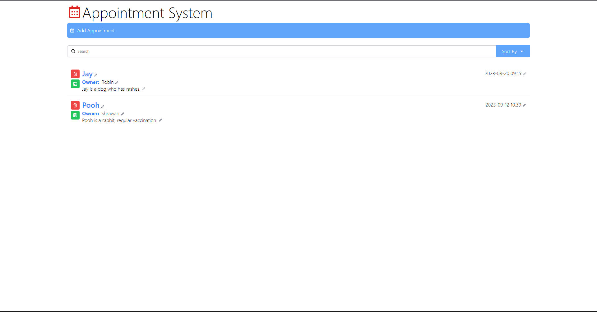
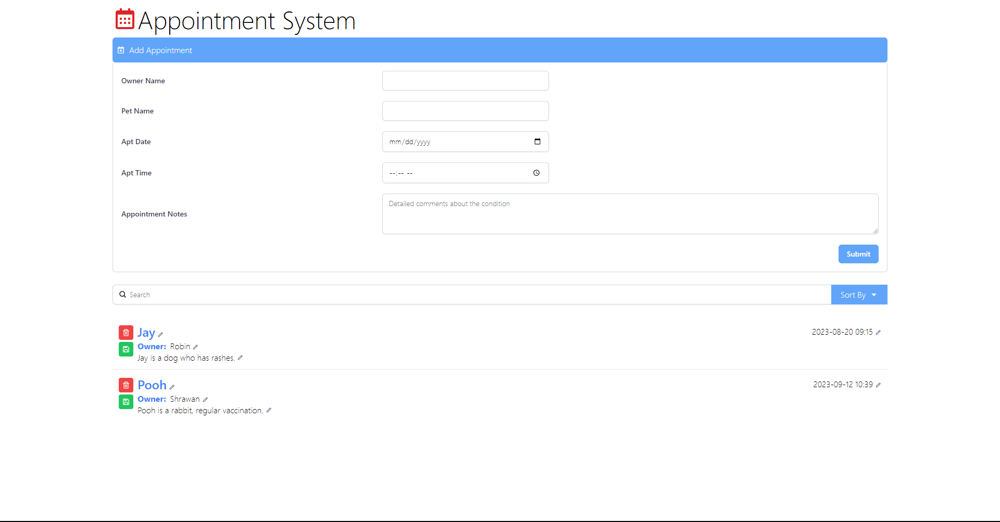

## <h1 style="color:#FF0000">Appointment System</h1>

This is an open source appointment system that allows users to create, update, delete or view appointments. It is built using MERN stack and postgresql as database.





## Tech Stack:

- React
- React Hook Form
- JS Fetch API
- TailwindCSS
- React Context API
- Zod
- Typescript

## Features Implemented:

1. Create, Update, Delete Appointment
2. Search & Sort API Integrated
3. Loading Skeleton
4. Form Validation

## Running Locally

1. Clone the repository

```js
git clone https://github.com/Aakashx2838/appointment-app-frontend.git
```

2. Install dependencies

```js
with yarn : yarn
with npm : npm i
```

## Run live demo

[https://appointment-app-frontend.vercel.app](https://appointment-app-frontend.vercel.app)
